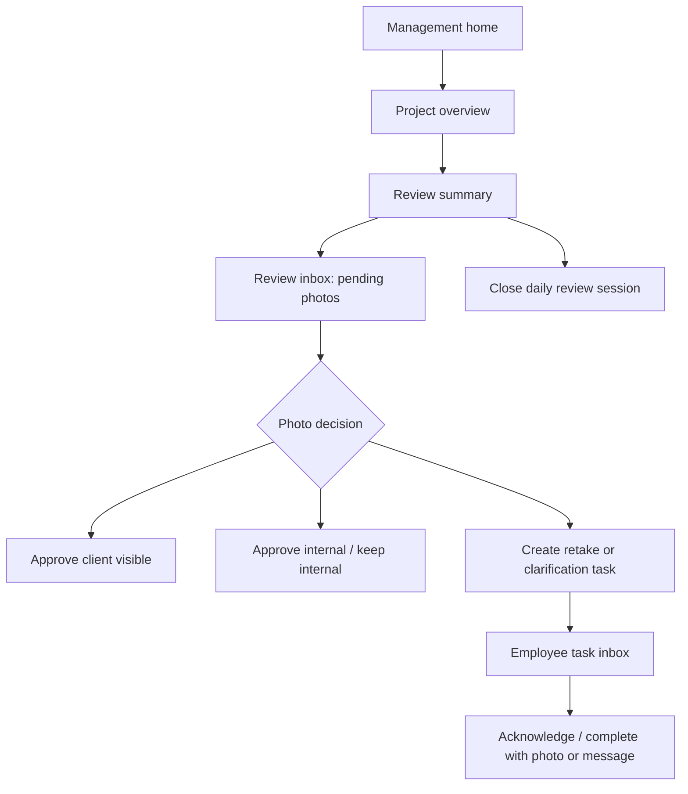

# Management Workflow Design

Date: 2026-07-08

Status: design draft, not implemented.

This document designs the next backend layer after `management-mobile-api.md`. The v1 API lets managers read project status and review photos. The next step is a real management workflow: retake requests, clarification requests, correction follow-up, and daily review closeout.

## Product Goal

The management mode should not become a smaller portal. It should let project managers handle the daily field evidence loop from a phone:

1. See which projects need attention.
2. Review uploaded photos.
3. Approve photos for client visibility or keep them internal.
4. Ask for clarification or retake when evidence is insufficient.
5. Track whether the request was acknowledged and completed.
6. Close the project review for the day.

This is a collaboration workflow, not performance scoring. It must not rank employees, assign blame, or claim that missing photos prove someone failed to work.

## Why Comments Are Not Enough

`photo_comments` can store a note, but it cannot reliably represent a workflow:

- no task type.
- no assignee.
- no status.
- no due date.
- no acknowledgment.
- no completion evidence.
- no daily closeout boundary.
- no structured APP inbox.

Using comments alone would force the APP to infer state from text. That would be fragile and would create inconsistent behavior between APP and portal.

## Proposed Tables

### `review_tasks`

Purpose: manager-created actionable requests tied to a project and optionally a photo.

Suggested columns:

- `id`: integer primary key.
- `public_id`: string UUID, unique, API-facing ID.
- `tenant_id`: string nullable, usually company_id.
- `company_id`: string, indexed.
- `project_id`: string, indexed.
- `related_photo_id`: integer nullable, indexed.
- `task_type`: string enum-like.
- `status`: string enum-like.
- `created_by_user_id`: integer, manager/admin user.
- `assigned_employee_id`: string nullable.
- `assigned_project_id`: string nullable, usually same as project_id.
- `message`: text.
- `due_at`: datetime nullable.
- `acknowledged_at`: datetime nullable.
- `acknowledged_by_employee_id`: string nullable.
- `completed_at`: datetime nullable.
- `completed_by_employee_id`: string nullable.
- `completion_photo_id`: integer nullable.
- `cancelled_at`: datetime nullable.
- `cancelled_by_user_id`: integer nullable.
- `metadata_json`: JSON nullable.
- `created_at`: datetime.
- `updated_at`: datetime.

Suggested `task_type` values:

- `retake_photo`: manager asks for a clearer or missing-angle retake.
- `clarify_photo`: manager asks for explanation/context.
- `correction_followup`: manager asks for follow-up evidence after correction.
- `internal_note`: structured internal reminder, not sent to employee by default.

Suggested `status` values:

- `open`: created and visible to target.
- `acknowledged`: employee saw/accepted it.
- `completed`: target provided response or completion evidence.
- `cancelled`: manager cancelled it.

Rules:

- `retake_photo`, `clarify_photo`, and `correction_followup` may be assigned to an employee or to the project.
- `internal_note` may have no employee assignment.
- A task can reference one original photo, but should not require one. Some missing-evidence requests may be project-level.
- `completion_photo_id` must belong to the same company/project and should usually be uploaded after the task was created.

### `review_task_events`

Purpose: immutable state/event history.

Suggested columns:

- `id`: integer primary key.
- `task_public_id`: string indexed.
- `company_id`: string indexed.
- `project_id`: string indexed.
- `event_type`: string.
- `actor_user_id`: integer nullable.
- `actor_employee_id`: string nullable.
- `message`: text nullable.
- `payload_json`: JSON nullable.
- `created_at`: datetime.

Suggested `event_type` values:

- `created`
- `commented`
- `acknowledged`
- `completed`
- `cancelled`
- `reopened`

Why separate events:

- AuditLog already records system audit, but APP needs a user-facing task history.
- Events allow future voice/text replies without changing task state fields too much.

### `review_sessions`

Purpose: manager's review batch for a project and day/window.

Suggested columns:

- `id`: integer primary key.
- `public_id`: string UUID unique.
- `company_id`: string indexed.
- `project_id`: string indexed.
- `review_date`: string/date in configured timezone.
- `status`: string enum-like.
- `created_by_user_id`: integer.
- `started_at`: datetime.
- `closed_at`: datetime nullable.
- `closed_by_user_id`: integer nullable.
- `summary_json`: JSON nullable.
- `created_at`: datetime.
- `updated_at`: datetime.

Suggested `status` values:

- `open`
- `closed`
- `reopened`

`summary_json` should contain database facts captured at close time:

- uploaded_count
- captured_count
- reviewed_photo_count
- approved_client_visible_count
- kept_internal_count
- rejected_count
- open_task_count
- completed_task_count

### `daily_project_closeouts`

Purpose: explicit day-level closeout record shown to managers.

This can be a separate table or folded into `review_sessions`. I recommend separate only if the business wants a durable daily sign-off object. For first implementation, use `review_sessions` with `review_date` and `status=closed` to avoid extra table count.

## API Design

All endpoints live under `/api/v2/management`.

### Create Review Task

```http
POST /api/v2/management/review-tasks
```

Request:

```json
{
  "project_id": "100010001",
  "related_photo_id": 1320,
  "task_type": "retake_photo",
  "assigned_employee_id": "100010002",
  "message": "Please capture the same area from farther back so the panel and surrounding wall are visible.",
  "due_at": "2026-07-09T22:00:00Z"
}
```

Response:

```json
{
  "task": {
    "public_id": "uuid",
    "project_id": "100010001",
    "related_photo_id": 1320,
    "task_type": "retake_photo",
    "status": "open",
    "assigned_employee_id": "100010002",
    "message": "...",
    "created_at": "..."
  }
}
```

Validation:

- manager must access project.
- related photo must be accessible and in same project.
- assigned employee must belong to company and either already be project-associated or explicitly allowed by product rule.
- message required for employee-visible tasks.

### List Review Tasks

```http
GET /api/v2/management/projects/{project_id}/review-tasks?status=open&limit=100
```

Filters:

- `status=open|acknowledged|completed|cancelled|all`
- `task_type=retake_photo|clarify_photo|correction_followup|internal_note`
- `assigned_employee_id`
- `related_photo_id`

APP use:

- project manager task inbox.
- project detail task list.
- photo detail task history.

### Update Review Task

```http
POST /api/v2/management/review-tasks/{public_id}/actions
```

Manager actions:

- `cancel`
- `reopen`
- `comment`

Employee actions, under a separate employee/mobile endpoint later:

- `acknowledge`
- `complete`
- `comment`

Completion request example:

```json
{
  "action": "complete",
  "completion_photo_id": 1331,
  "message": "Retake uploaded with wider view."
}
```

### Start Or Get Review Session

```http
POST /api/v2/management/projects/{project_id}/review-sessions/current
```

Purpose: creates or returns the current day's open review session.

Request:

```json
{
  "review_date": "2026-07-08"
}
```

### Close Review Session

```http
POST /api/v2/management/review-sessions/{public_id}/close
```

Close only means "manager reviewed this window". It must not mean all field work is complete.

Response should include:

- closeout summary counts.
- remaining open task count.
- closed_at.
- closed_by_user.

## APP Flow



## Employee-Facing Rules

Employee wording should be collaborative:

- "Please add one more photo for project memory."
- "A wider angle would help the team understand this location."
- "Please add context for this photo."

Avoid:

- "You failed to..."
- "Urgent"
- "Must"
- employee ranking
- performance score
- blame language

## Permissions

Management user:

- company admin: all company projects.
- manager/project_manager: assigned projects.
- client: no management task endpoints.
- worker/employee user: no management task endpoints.

Employee task endpoints, when implemented:

- employee can only see tasks assigned to their employee_id or project-level tasks intended for their project.
- employee cannot see internal manager notes.
- employee cannot approve client visibility.

## Migration Plan

Recommended Alembic migration:

1. Add `review_tasks`.
2. Add `review_task_events`.
3. Add `review_sessions`.
4. Add indexes:
   - `(company_id, project_id, status)`
   - `(company_id, assigned_employee_id, status)`
   - `(related_photo_id)`
   - `(review_date, project_id)`
5. No changes to existing `photos`, `photo_comments`, or upload tables.

Backward compatibility:

- Existing management v1 endpoints continue to work.
- Existing portal photo review continues to work.
- Existing employee upload API remains unchanged.

Rollback:

- v1 endpoints do not depend on new tables.
- If task API has issues, disable only task endpoints.
- Tables can remain unused without affecting upload/photo/report paths.

## Acceptance Tests

Minimum service tests:

- project_manager can create retake task for assigned project photo.
- project_manager cannot create task for cross-project photo.
- client cannot access task endpoints.
- worker cannot access task endpoints.
- assigned employee can see assigned task through employee endpoint.
- other employee cannot see it.
- task completion photo must belong to same project/company.
- close review session records summary counts.
- closing review session does not auto-approve photos.
- all task actions write `review_task_events` and `AuditLog`.

Manual production smoke after deployment:

- existing `/upload` works.
- existing `/photos/me` works.
- existing portal photos page works.
- management v1 overview works.
- create task, list task, cancel task works on one test project.
- no customer-visible output changes unless a manager explicitly approves client visibility.

## Implementation Order

Recommended next backend implementation:

1. Add models and Alembic migration only.
2. Add service functions for task create/list/action.
3. Add management task API.
4. Add tests.
5. Add employee task read/acknowledge API.
6. Update APP contract docs.
7. Only then consider portal UI integration.

## Open Product Decisions

1. Can a project manager assign a task to any company employee, or only employees already assigned to that project?
2. Should project-level tasks be visible to all project employees or only to project managers?
3. Should completion require a new photo for `retake_photo`, or allow a text explanation?
4. Should `daily closeout` be required before client publishing, or independent?
5. Should clients ever see closeout summaries, or only selected photos/reports?

